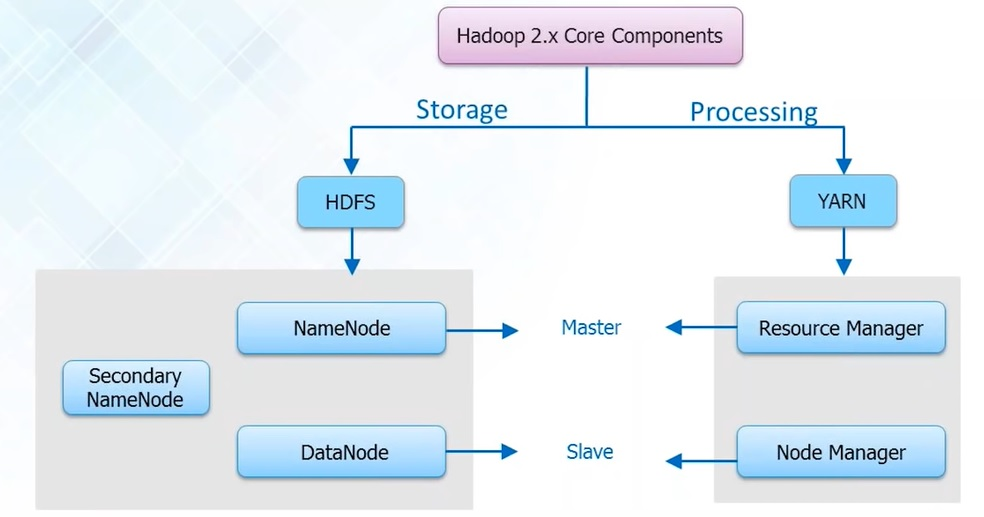
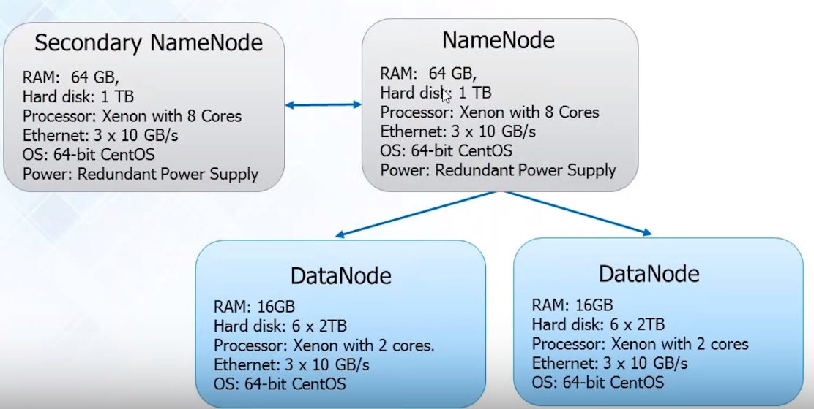

# Hadoop Multi-Node Setup

So far we have spent a lot of time dealing with specific details of setting up the Hadoop ecosystem.  With all the details, we may fail to see the forest for the trees (or the trees for the forest?).  

Towards that goal, for this tutorial, we would like to start off with a birds eye view of where things fit in.  You always have to look at a Hadoop ecosystem in two ways: one is storage and one is processing.  Hadoop always revolves around either storage or processing.  All the "technologies" that we briefly mentioned (MapReduce, Hive, PIG, Spark etc) somehow fit into one of these tasks and not all are complementary.  Some technologies are replacing others and the ecosystem is continuously evolving.

To get a sense of why we need Hadoop, it is a good idea to take a look at a real world example.  When purchasng any product on the web these days, you are often get suggestions on what other users of similar products have bought.  THis is called a <b>recommendation enging</b> and Amazon was the first to implement it.  According to them, within the first month of implementing this recommendation enging, their sales jumped 30%!

Now to make accurate predictions with a recommendation engine, you need historical data.  The more data you have, the more accurate the recommendation will be.  Now perhaps if you are looking at the data from the last 2 months, this may not be a problem but when you look at data for the past year, past 5 years, the volume of data just becomes unmanageable.  This is the whole concept of "Big Data".

So now you need to somehow store this huge amount of data and then do some analysis on it.  Traditionally, you would have needed to invest in some kind of storage server - thousands upon thousands of computers in a environmentally controlled room with full time staff to look after and maintain it.  On top of this, you need to somehow analyze this data and it wasn't exactly clear how to approach this problem.

This is where Hadoop came in as an alternative approach that addresses both the problem of storage and processing (analysis).  This can be shown in the diagram below:



The <b>storage is called HDFS</b> or Hadoop Distributed File System and the <b>processing is called MapReduce or YARN</b>.

The architecture for both these components is based on a master and slave system.  For HDFS, the master is called NameNode and the slave is called DataNode.  For YARN, the master is called Resource Manager and the slave is called NodeManager.  SecondaryNameNode in the daigram above is just a backup for NameNode.  

Now the names may seem strange but essentially they are java <a href="https://en.wikipedia.org/wiki/Daemon_(computing)">daeomons</a>, processes that run indefinitely (unless you specifically stop them) and manage the storage and the processing of information.  The java processes for HDFS are built into the Apache Hadoop and you downloaded and installed this in the first tutorial.  THe MapReduce framework is also implemented but the actual programming for a particular problem (the mapping and reducing) must be written by a developer.  We looked at a very simple example of using MapReduce to find the word count of a textfile but there can be other more interesting problems that we will look at later.

Physically, a Hadoop cluster may look like the following:




Here each box represents a physical maschine.  DataNode, NameNode and Secondary NameNode are daemons.  In the above example, we are showing the HDFS daemons that will run on our cluster.  But parallel to this we will also have our YARN daemons (they do not exist on a separate cluster, but are part of the same cluster).  In that case, the master node will have two daemons (NameNode


After the clone, for each node click on settings, Network and change the adaptor to 
Check if the slave node and the main node can communicate with each other.  We will do this by "pinging" each using the ping command from the terminal.

In each machine, type the following command:

> ifconfig

Take note of the output and jot down the ip address for both your original node (the master) and the slave node as shown in the figure below.


Now try to ping both the slave and the master from the other machine.

> ping ip_address

```
hduser@HadoopNode:~$ ping 10.101.243.183
PING 10.101.243.183 (10.101.243.183) 56(84) bytes of data.
64 bytes from 10.101.243.183: icmp_seq=1 ttl=64 time=0.414 ms
64 bytes from 10.101.243.183: icmp_seq=2 ttl=64 time=0.896 ms
64 bytes from 10.101.243.183: icmp_seq=3 ttl=64 time=0.512 ms
^C
```

The output should be something as above.  To stop the ping enter CTRL-C.

We need to now change the name of the machines.  Since we cloned our original Hadoop Node to get a master and slave, both nodes now have the same name (whatever name you chose for your original machine).  Remember, the machine name is always displayed in the terminal prompt after user name and the @ sign.  (hduser@[machinename])

To change the machine name, execute the following command on both your slave and master node:

> sudo gedit /etc/hostname

For the slave machine, change the machine name to "slave01".  For the master, change the machine name to "master".

We will now configure all the IP addresses.  We need a way for the master and slave to know each other's ip address.

> sudo gedit /etc/hosts

You should see something like the following:

```
127.0.0.1	localhost
127.0.1.1	HadoopNode

# The following lines are desirable for IPv6 capable hosts
::1     ip6-localhost ip6-loopback
fe00::0 ip6-localnet
ff00::0 ip6-mcastprefix
ff02::1 ip6-allnodes
ff02::2 ip6-allrouters
```

Here HadoopNode is the machine name (that we just changed).  It may be different for your machine.  First delete or comment out the old address "127.0.1.1 [machine_name]" and place the IP address and name of the master and slave nodes as follows:

```
10.131.248.81 slave01

10.101.243.183 master
```

Note that your IP addresses will be different.  

Do the same thing for your other node (slave or master depending on what you did first).

For the changes to take effect, we need to reboot our machines. For both master and slave, enter the following command:

> sudo reboot

Log in to both machines and open a terminal.  You should see the hostname changes having taken effect (The master node now has a prompt of hduser@master and slave is called hduser@slave).  If not, check again that the hostname file was changed and saved as outlined  above.

For a sanity check though, run the following command on both master and slave:

> hostname

You should get master and slave as output for the particular machine.

## Ping Master and Slave using host name

We will now try to ping each node using the host name rather than the IP address.  This will confirm that the IP addresses and names were changed correctly.  

> ping slave01

You should see something similar to the following:

```
hduser@master:~$ ping slave01
PING slave01 (10.131.248.81) 56(84) bytes of data.
64 bytes from slave01 (10.131.248.81): icmp_seq=1 ttl=64 time=0.313 ms
64 bytes from slave01 (10.131.248.81): icmp_seq=2 ttl=64 time=0.340 ms
64 bytes from slave01 (10.131.248.81): icmp_seq=3 ttl=64 time=0.340 ms
64 bytes from slave01 (10.131.248.81): icmp_seq=4 ttl=64 time=0.456 ms
64 bytes from slave01 (10.131.248.81): icmp_seq=5 ttl=64 time=0.722 ms
64 bytes from slave01 (10.131.248.81): icmp_seq=6 ttl=64 time=0.354 ms
^C
--- slave01 ping statistics ---
6 packets transmitted, 6 received, 0% packet loss, time 5106ms
rtt min/avg/max/mdev = 0.313/0.420/0.722/0.144 ms
hduser@master:~$ 
```

Similarly, perform the same test on the slave

> ping master

You should get a similar output as for the master case.  If not, then check your hosts files (sudo gedit /etc/hosts) and make sure the name of the machines and their IP addresses have correctly been entered.


## Test SSH connectivity

From both the slave and master, try to first ssh to your own machine and to the other machine.  

> ssh master

> ssh slave01

Type yes for any prompts.  <b>You should be able to SSH without any password requests</b>.  If you get a password request, despite having a public authorization key, this generally means that your permissions on the directory or files are incorrect.  Your permission for your user directory (hduser) and .ssh folder (among others) must be 700 or 755 (read, write and execute privileges for the host, read only for everyone else).  See the issue being discussed <a href="https://unix.stackexchange.com/questions/36540/why-am-i-still-getting-a-password-prompt-with-ssh-with-public-key-authentication"> here </a>

## Update your configuration files

You need to update your core-site.xml <b>for master and slave(s)</b> and "localhost" to "master".  We will also remove the temporary directory.  Bring up the file in a text editor.

> sudo gedit $HADOOP_CONF_DIR/core-site.xml

Change <b>core-site.xml</b> file so that it only has the following:

```
  <property>  
    <name>fs.defaultFS</name>
    <value>hdfs://master:9000</value>
    <description> localhost may be replaced with a DNS that points to the NameNode. </description>
  </property>
</configuration>
```

For hdfs-site.xml configuration file, we need to delete any datanode parameters because our datanode is now on a separate machine (slave01).  In other words, the master node is our namenode and will not store any data - this will be done in the slave node (or slave nodes).  So change the <b>hdfs-site.xml</b> according to the following:

```
<configuration>
  <property>
    <name>dfs.replication</name>
    <value>2</value>
    <description> Default block replication.
      The actual number of replications can be specified when the file is created.
      The default is used if replication is not specified in create time.
    </description>
  </property>
  <property>
    <name>dfs.namenode.name.dir</name>
    <value>file:///home/hduser/hadoop_data/hdfs/namenode</value>
  </property>
  <property>. 
     <name>dfs.permissions.enabled</name>
     <value>false</value>
  </property>
</configuration>
```

Now consequencyt in the slave node, you will have the datanode - it will store the data, but it will not have the namenode.  So we need to change the hdfs-site.xml file in the slave node and delete all references to the namenode.

```
<configuration>
  <property>
    <name>dfs.replication</name>
    <value>2</value>
    <description> Default block replication.
      The actual number of replications can be specified when the file is created.
      The default is used if replication is not specified in create time.
    </description>
  </property>

  <property>
    <name>dfs.datanode.data.dir</name>
    <value>file:///home/hduser/hadoop_data/hdfs/datanode</value>
  </property>
  <property>
     <name>dfs.permissions.enabled</name>
     <value>false</value>
  </property>
</configuration>
```

Now we need to update our <b>yarn-site.xml</b> (across all nodes).  The only change here for us is to change the namenode from localhost to master.

```
<configuration>
  <property>
    <name>yarn.nodemanager.aux-services</name>
    <value>mapreduce_shuffle</value>
  </property>
  <property>
    <name> mapred.job.tracker</name>
    <value> master:9001</value>
  </property>
</configuration>
```

Leave the <b>mapred-site.xml</b> as before.

## Update master and slave files

There are several helper files on the master node that are used by hadoop scripts to start appropriate services on master and slave nodes.  We need to update these files. 

In the <b>master node</b>, execute the following command:

> sudo gedit /usr/local/hadoop/etc/hadoop/slaves

In the file that opens, you should see "localhost".  Delete this and put "slave01".  If you had more than one slave node, you would put the list in this file.

Again on the master node, execute the following command:

> sudo gedit /usr/local/hadoop/etc/hadoop/masters

This file should be empty (because it does not exist and you have created it by the above command).  In this file, simply write the name of your master node, in our case "master".


## Recreate Namenode folder (master only)

We need to delete our old namenode directory and recreate the namenode directory with appropriate permissions.  To do so, execute the following commands:

> sudo rm -rf /usr/local/hadoop_tmp

> sudo mkdir -p /usr/local/hadoop_tmp/hdfs/namenode

> sudo chown hduser:hadoop -R /usr/local/hadoop_tmp/

> sudo chmod 777 /usr/local/hadoop_tmp/hdfs/namenode

## Recreate Datanode folder (slaves only)

Similary in the slave nodes, I need to delete the datanode folder and recreate it with appropriate permissions

> sudo rm -rf /usr/local/hadoop_tmp

> sudo mkdir -p /usr/local/hadoop_tmp/hdfs/datanode

> sudo chown hduser:hadoop -R /usr/local/hadoop_tmp/

> sudo chmod 777 /usr/local/hadoop_tmp/hdfs/datanode

## Format the Namenode (master only)

Before starting the cluster, we need to format our namenode:

> hdfs namenode -format

## Start HDFS and YARN (master only)

We will start our daemons on our master node.

> start-dfs.sh

> start-yarn.sh

After HDFS and YARN are started, on the master node, check what daemons are running:

> jps

You should see three processes as shown:

```
hduser@master:~$ jps
2737 NameNode
2949 SecondaryNameNode
3420 Jps
3119 ResourceManager
```
On the slave node, check what processes are running:

> jps

You should see:
```
hduser@slave01:~$ jps
2381 Jps
2253 NodeManager
2284 DataNode
```
Now start YARN:

> start-yarn.sh

The master will then log onto to the slave node and start the necessary deamons there through ssh.

Now see the java proceses that you have:

> jps

You should see should see a Namenode daemon.

Now go to your slave node:

> jps

You should see a Datanode started here.
